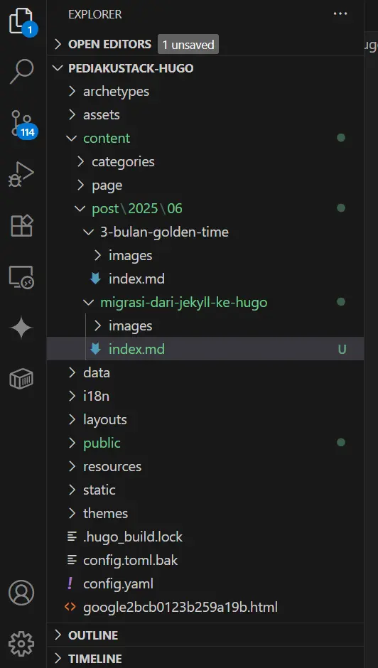

Setelah beberapa bulan menggunakan Jekyll, *[Pediaku ID](/)* akhirnya memutuskan untuk full *[migrasi jekyll ke Hugo](/migrasi-jekyll-ke-hugo/)*. Yap, Hugo salah satu *Site Static Generator* (SSG) dari Google yang powerfull dan jauh lebih cepat.

***Hugo SSG*** menggunakan bahasa GO yang terkenal akan kecepatannya, *build* situs hanya butuh hitungan beberapa milisecond, dan situs bisa dijalankan. Ini sungguh menakjubkan.

## Dulu Saya Menggunakan Jekyll
Dulu saya menggunakan jekyll, karena mudah dipelajari oleh pemula sekalipun. Menggunakan bahasa Ruby, dan didukung langsung oleh **GitHub Pages** menjadi sangat sesuai bagi kebutuhan pengguna, mudah, dan cepat. 

Kelebihan jekyll lain yang saya rasakan selama menggunakannya
* **Komunitas yang besar**, walaupun tidak sebesar *web builder* seperti Blogger, Wordpress. Komunitas Jekyll cukup ramai dan aktif membantu pengguna lain
* **Ramah pemula**, saya rasa Jekyll cukup mudah dipahami, mulai dari struktur folder blog maupun cara kerjanya. 
* **Theme cukup banyak**, terakhir pilihan template jekyll yang cukup berlimpah dan dapat didownload gratis oleh semua orang.


## Kenapa Saya Pindah ke Hugo?
>Karena penasaran, saya iseng mencoba membangun blog baru menggunakan Hugo, blog hugo pertama saya yaitu Akazed, pengalaman ini saya post di halaman *[pengalaman menggunakan hugo](https://akazed.com/welcome-to-my-hugo-blog/)*. 

Kembali ke pertanyaan pertama, kok Pediaku ID memilih migrasi ke Hugo? berikut alasannya:
1. **<u>Build Site Menjadi Lambat</u>**, Postingan Pediaku ID sudah semakin banyak, dan kecepatan build Jekyll mulai terasa lambat. bayangkan, butuh waktu lebih dari 20 detik untuk build site. Ini buang-buang waktu. Hal ini membuat saya sadar kenapa *Sass sudah tidak menggunakan Ruby*.
2. **<u>Lebih Mudah Kostumisasi Blog Hugo</u>**, walaupun jekyll dengan ruby nya cukup mudah dipahami, dengan bantuan AI saat ini Hugo menjadi pilihan yang lebih baik, kalian bisa bertanya ke AI untuk membangun tampilan blog, mulai dari desain, struktur, script dan lainnya. 
3. **<u>Fitur Hugo Lebih Banyak</u>**, fitur dasar hugo lebih banyak seperti SEO, dan github comment. Berbeda dengan jekyll yang harus ditambahkan manual.


## Tahap Migrasi Blog Pediaku ID Ini Schedule nya
Seperti yang kamu tahu, Pediaku ID sebelumnya sudah punya beberapa artikel dan itu cukup banyak. Beberapa tahapan migrasi yang akan saya lakukan

### Setting Template Dasar
Pediaku ID memilih template Hugo Stack Theme, awalnya saya ingin menggunakan template *[Geous Hugo Theme](https://akazed.com/gerous-hugo-theme/)*, namun setelah beberapa pertimbangan akhirnya terpilihlah Hugo Stack Theme, karena mudah dicostum. 

Jujur saja, struktur template hugo gerous yang saya katakan sebelumnya membuat saya agak bingung. Ingat saya hanyalah seorang pemula tanpa pemahaman bahasa koding.

Settingan Hugo hampir sama dengan Jekyll, menggunakan config.yaml, atau config.toml berikut contoh isi config saya
```yaml
baseurl: https://pediaku.id #TODO 
languageCode: en-us
#theme: hugo-theme-stack hugo-theme-stack-3.17.0
theme: hugo-theme-stack-3.17.0
paginate: 6
title: Pediaku ID - Bloging & Tech Info  #TODO 博客标题


languages:
  id:
    languageName: Indonesia
    weight: 1

# Change it to your Disqus shortname before using
disqusShortname: pediaku

# GA Tracking ID
googleAnalytics: G-2TLDCKC669 #TODO Google分析
#googleAnalytics:
# Theme i18n support
# Available values: en, fr, id, ja, ko, pt-br, zh-cn, zh-tw, es, de, nl, it, th, el, uk
DefaultContentLanguage: id

# Set hasCJKLanguage to true if DefaultContentLanguage is in [zh-cn ja ko]
# This will make .Summary and .WordCount behave correctly for CJK languages.
hasCJKLanguage: true

permalinks:
    post: /:slug/ #TODO 链接形式
    page: /:slug/
```

>Hal yang sangat penting adalah mengisi BaseURL:, sebelumnya saya lupa mengisi BaseURL dan ini membuat sitemap menjadi error.

Setelah mengatur tampilan, menambahkan header images, logo dan favicon saya lanjutkan dengan mengedit postingan

### Mengedit dan Publikasi Ulang Semua Artikel Secara Bertahap
Membangun blog statis butuh waktu yang lama dan agar ribet jika ingin migrasi ke generator lain. Mau tidak mau kita harus mengedit manual seluruh postingan dan menyesuaikannya kembali.

Frontmatter Blog hugo saya agar berbeda dibanding Jekyll sebelumnya, truktur slug pun harus kembali disamakan. 

Ini tidak semudah migrasi *[blogger](/categories/blogger/)* ke wordpress, yang mana hanya perlu download backup .xml dan upload ke Wordpress.

>Saya mula dari hari *Kamis, 19 Juni 2025*, karena tidak bisa fulltime didepan layar ini akan butuh waktu. 

Artikel pertama yang diterbitkan ketika awal menggunakan hugo ini adalah *[golden time relaksasi efaktur](/golden-time-relaksasi-efaktur/)* yang bahas perpajakan.


## Penutup
Saya menganggap proses Migrasi blog dari Jekyll ke Hugo adalah sebuah game dengan tantang level HARD, bukan karena sulit tapi HARD karena butuh waktu yang banyak.

Cara migrasi jekyll ke hugo sebenarnya gampang, cuma memakan waktu Anda.